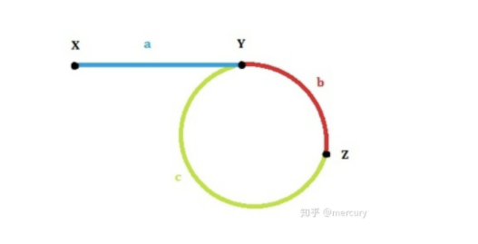

### 线性表链式存储

1. 头插法
   - 在申请头节点空间后，要将next置为空值（应对长度为0的情况）
   - 头插法函数传递参数时传入的是一个还未进行申请空间的指针，首先申请空间，初始化指针，及参入的参数同时代表头节点，随后读取节点的值，在循环中新建节点，申请空间，随后改变指针（和头节点的指针进行变换）。

2. 尾插法
   - 创建一个新的Node指针用于指向表尾，初始化时，指向头节点，在最后一个节点时，要将next置为空值，防止脏数据带来的影响。

3. 查找元素

   - 辨别是否有头节点，若存在头节点，指针需要转换到第一个节点之后再进行查询。

4. 插入元素

   - 插入新节点时需要将节点指针定位到目标位置节点的前一个结点，随后进行操作

5. 删除元素

   - 和插入元素一样都是找到目标节点的前一个节点，其中包括（按照位置找节点<即找到(i-1)节点>，或是按照节点的值寻找节点(p->next->data = q->data)节点p就是目标节点的前一个节点）

6. 双向链表中的操作

   - 插入节点：先将插入节点的后继指针、下一个节点的前驱指针修改再进行后续的修改

   - 删除节点：注意是否是最后一个节点，需要进行判断

     ```c++
     if (q->next != NULL) {//q->next为NUll删除的是最后一个节点
     		q->next->prior = p;
     	}
     ```


### 栈的实现

1. 数组->栈
   - 容量有限，操作时要注意栈顶指针的移动
2. 链表->栈
   - 链表实现的栈主要是利用链表的头插、删除第一个节点，一般使用不带头结点的链表

### 栈的应用

#### 中缀转前缀（理解概念-> 写出代码）

1. 确定操作运算符的优先级  */ > +- > (
2. 输入两个字符串（串1代表输入的中缀表达式，串2是引用的，是用来保存后缀表达式的），创建新栈用于存储
3. 从第一个开始处理
   1. 首先判断，如果是数字则直接添加入后缀表达式中，如果是非数字则开始判断
   2. 在判断中，首先判断**栈是否为空**，空栈可以直接压入，如果是（  则直接压入空栈中，如果是  ） 则让栈中的操作符逐个pop，并添加到后缀表达式的末尾，直到遇到 （ ，pop出去后，不加到后缀表达式的后面。如果是操作符则开始判断，若当前**压入的操作符的优先级小于等于栈顶的操作符的优先级**，栈顶的操作符pop之后继续循环，**直到栈空（break）**或优先级比较发生改变（跳出while循环），将该运算符压入栈中。
   3. 这个for循环之后，将栈中剩余的操作符依次加到后缀表达式中。

#### 后缀的计算

1. 遍历字符串，遇到操作数压入栈中，遇到操作数，则把**前两个**操作数取出，进行运算，再将结果压入栈中
2. 最后将栈中最后的元素进行输出

### 队列

1. 数组->循环队列
   - 判断队列是否为空->队列头指针等于队列尾指针
   - 判断队列是否会满->（队列尾指针+1 ）%最大容量= 队列头指针
   - 队尾、队头的指针都是向后移动
   - 每次指针向后移动时都需要进行取余的操作
2. 链表->队列(需要两个指针分别指向链表的表头和表位)
   - 插入->头插，删除->尾部删除，相反也行

### 树

### 二叉树 （***）

1. 特殊的树形结构，每个结点至多有两个子树（不存在度大于2的结点），两个子树的位置不能够颠倒
2. 存储结构：顺序存储和链式存储
3. 层次遍历建树：
   - 用到的数据结构：树（左子树、右子树、数据）、队列
   - 先将根节点入队，当队列不为空的时候循环进行以下操作：
     - 分别用指针指向队列的头（head）、当前进行操作的树节点（cur）、队列的尾（rear）
     - 读取新节点，为新节点分配空间，新节点入队
       - 若队列为空，continue
       - 队列不为空，根据cur的左右子树情况进行操作（若cur 的左子树为空，将rear指向的节点放入cur的左子树，若cur 的左子树不为空，将rear 指向的节点放入cur 的右子树，并将cur指向队列的下一个元素，且队列出队**因为已经确定了树的一个节点就不需要该节点了，一般情况下cur和head指向的是队列中同一个节点**）

### 常见问题解答

1. 查找当前数组中的重复元素，或是找出这个元素，常见的解法有
   - 创建一个用于记录元素出现个数的数组（一般用于知道元素大小、规定在某个大小区间内）
   - 使用位运算，即异或，当异或的结果为1时，找出当前这个元素，即该元素在前面已经出现过了
2. 双指针的使用
   - 一个用于遍历，另一个用于操作
   - 快慢指针的使用：快指针每次向前移动2步，慢指针移动1步
     - 
     - 解决链表中存在环的情况=> 快指针和慢指针同时从起点出发直到在z点相遇，在这个移动的时间内，慢指针走过的长度**a+b**，快指针走过的长度为**a+n(b+c)+b**,其中b+c代表形成环的周长，快指针可能不止走了一圈，所以想要判断是否单链表形成一个环，就可以检测这两个指针最后能否相遇。
     - 想要找到形成环的点移动方程得到 **a =(n-1)b+c**,我们再放两个指针，将first放在x，second放在z，速度保持一致，first跑到y的时候，second也会跑到y，当她们相遇的时候就是环形成的起点。

